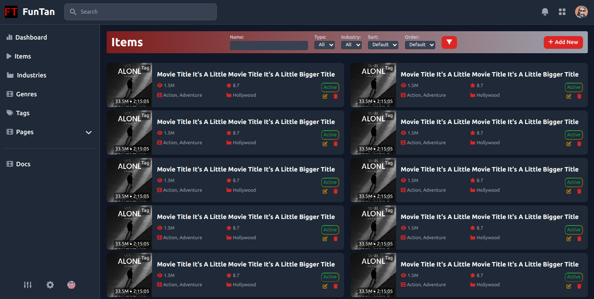

# Query Parameter Documentation

## Screen Shots

## Overview
The `type` query parameter is used to categorize media content within the application. Each `type` value corresponds to a specific category.

## `type` Parameter Values
Below is the list of accepted values for the `type` query parameter and their corresponding categories:

| Value | Category             |
|-------|-----------------------|
| `1`   | Movie                |
| `2`   | TV Show              |
| `3`   | Web Series           |
| `4`   | Short Film           |
| `5`   | Animation            |

## `sort` Parameter Values
Below is the list of accepted values for the `sort` query parameter and their corresponding sorting criteria:

| Value | Sort By           |
|-------|-------------------|
| `1`   | Name              |
| `2`   | Date              |
| `3`   | Views             |
| `4`   | Duration          |
| `5`   | New & Popular     |
